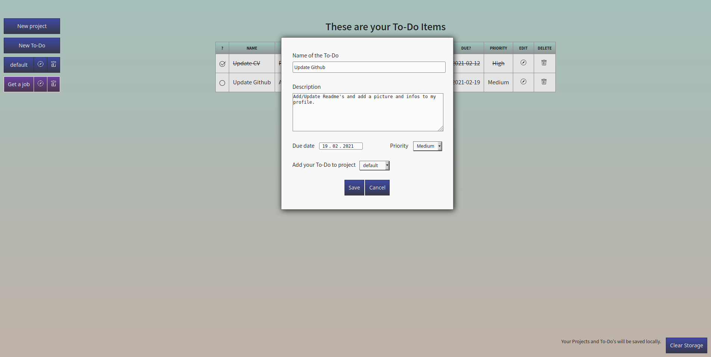

# Todo list

A todo list app for the JavaScript curriculum at [The Odin Project](https://www.theodinproject.com) that implements the basic CRUD operations. So far, this has been my longest and most complex JavaScript project.

## Features

- C: Create projects and assign them todo's
- R: The todo's are displayed in a table on a per project basis
- U: Rename your projects, cross out finished todo's or edit their name, description, due date, priority or the project they are assigned to
- D: Delete projects and todo's

## Design

- This application is frontend only. The data is saved via localStorage as arrays of objects.
- Two classes serve as the blueprint for projects and todo's.
- There a three modules (so, here we have a classic Model-View-Controller pattern. However, back then when I started this project, this was not really so clear to me):
  - boardcontroller.js manipulates the data, i.e. creating, changing or deleting project- or todo-objects.
  - displaycontroller.js manipulates the DOM.
  - index.js coordinates the other two modules.

## Reflection

- Versus the end, I found the project quite frustrating. I spent hours to find and fix bugs and unintended consequences of code. A little more thought upfront could have saved me hours of work. In the future I will try to plan better and think stuff through more thoroughly before starting to code.
- One major problem in this project were the eventlisteners because I didn't know about event delegation. In my View I dynamically created buttons for editing or deleting projects and todo's. For them to work, I had to attach an eventlistener. But this eventlistener needed to "somehow" "tell" the Model to edit/delete the corresponding item when the button is clicked (thus injecting some Controller logic into the View). I solved this then by using PubSubJS.

## Built with

- [webpack](https://webpack.js.org/)
- [PubSubJS](https://github.com/mroderick/PubSubJS#readme)

## Demo

[View it here](https://reinimax.github.io/todo-list/)
